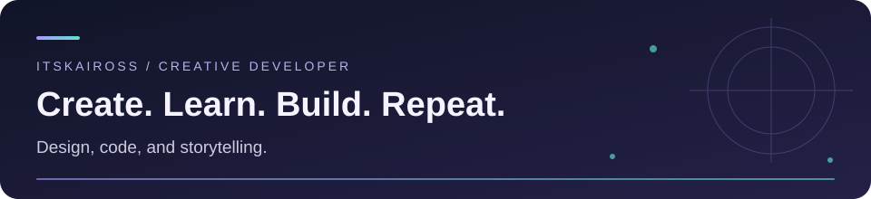
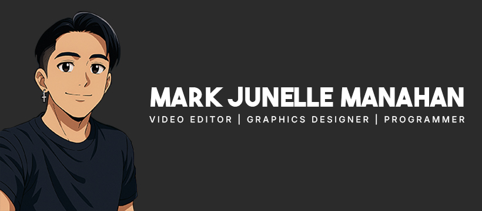

<!-- Hero Section -->

# Hi there, I'm Mark Junelle 👋

<h3>🎬 Video Editor • 🎨 Graphic Designer • 💻 Full Stack Developer</h3>

> *Building creative experiences through design, code, and storytelling.*

<!-- Status Badges -->

<!-- Social Links -->

 

<!-- Animated divider -->

 

## 🚀 About Me

I'm **Mark Junelle Manahan**, a multidisciplinary creative passionate about combining **technology and design**. I enjoy building web applications, editing engaging videos, creating eye-catching graphics, and constantly learning new technologies.

- 🎬 Professional Video Editor
- 🎨 Graphic Designer
- 💻 Full Stack Developer
- 🌍 Remote-friendly & flexible across time zones
- 🚀 Always learning something new

 

## 💼 What I Do

<table>
<tr>
<td width="33%" align="center">

### 🎬 Video Editing
Professional editing with Adobe Premiere Pro, After Effects, and more. Crafting engaging narratives through visual storytelling.

</td>
<td width="33%" align="center">

### 🎨 Design
Creating eye-catching graphics and intuitive interfaces using Photoshop, Figma, and Canva.

</td>
<td width="33%" align="center">

### 💻 Development
Building full-stack applications with modern frameworks and clean, maintainable code.

</td>
</tr>
</table>

 

## 🛠️ Tech Stack

<b>💻 Languages</b>

 

<b>🚀 Frameworks & Tools</b>

 

<b>🤖 AI Assistants</b>

 

**Development Tools:**  
🤖 Kiro • Claude Code • Cursor AI

<b>🎨 Creative Suite</b>

 

**Video Editing:**  
🎬 Adobe Premiere Pro • After Effects

**Design:**  
🎨 Adobe Photoshop • Figma • Canva

**Collaboration:**  
📦 Frame.io • Dropbox • Google Drive

**Project Management:**  
📋 Notion • Trello • ClickUp • Slack • Asana • Monday.com

 

## 🌟 Featured Projects

<table>
<tr>
<td width="50%" valign="top">

### 🗂️ [Work Manager](https://github.com/ItsKaiross/Work-Manager)
**AI-Powered Job Application Tracker**

Tracks applications end-to-end (Saved → Applied → Interviewing → Offer) with AI resume-to-job match scoring and personalized interview prep.

- Resume matching, job summaries, and personalized interview preparation
- Activity heatmap, application pipeline, and source analytics
- Status-based follow-up reminders and quick pipeline updates
- Multiple resumes, targeted job keywords, and multi-currency tracking

`FastAPI` `MySQL` `Next.js` `TypeScript` `Tailwind CSS`

</td>
<td width="50%" valign="top">

### 🔎 [OnLook](https://github.com/ItsKaiross/Onlook)
**Missing Person Reporting Platform**

- 🗺️ Real-time tracking & geolocation
- 👮 Law enforcement dashboard
- 🎯 Community-focused solution

`Flask` `Python` `JavaScript`

</td>
</tr>
<tr>
<td width="50%" valign="top">

### 💸 Kaiflow
**Local-First Transaction & Cash Reconciliation System**

Built for cash-in and cash-out stores, from staff transaction entry to branch-level reporting.

- Protected receipt uploads with optional local Tesseract OCR
- File and reference-number duplicate detection with admin review
- Service-fee calculation, daily reconciliation, and branch reporting
- Staff, Admin, and Super Admin roles with audit history

`FastAPI` `Next.js` `TypeScript` `SQLAlchemy` `SQLite / MySQL`

</td>
<td width="50%" valign="top">

### 🎓 K Connect
**Campus Organization & Event Platform**

- Multi-tenant organizations, branded public pages, and role-based access
- Event proposals, approval history, and branded PDF / Word exports
- Student QR attendance, recurring training sessions, and roster management
- Organization documents, version history, and resolution workflows

`FastAPI` `Next.js` `TypeScript` `MySQL` `WebSockets`

</td>
</tr>
<tr>
<td colspan="2" valign="top">

### 🎮 Solo Grind
**Gamified Productivity & Personal Growth Platform**

- Recurring quests, timed focus sessions, skill progression, and achievements
- AI-assisted learning paths, boss objectives, and a context-aware mentor
- Seven-day cooperative Party Raids, PvP modes, and weekly leaderboards
- Grind Journal, Weekly Review, quest templates, and focus scheduling

`FastAPI` `Next.js` `TypeScript` `MySQL` `Groq AI`

</td>
</tr>
</table>

 

## More Projects

| Project | What it does | Built with |
| --- | --- | --- |
| **KQuota** | Desktop usage widget with reset countdowns, automatic refresh, and detachable provider cards for Claude and Codex. | Tauri / React / TypeScript / FastAPI |
| **Kvaults** | Local encrypted password vault with TOTP setup, password generation, weak / reused password reports, and backup / restore. | Python / Tkinter / SQLite / cryptography |

Project descriptions reflect local project documentation reviewed in September 2026.

 

## 📊 GitHub Analytics

## 💼 Professional Experience

<table>
<tr>
<td colspan="3" valign="top">

### 💻 Freelance Full-Stack Developer
Web Applications & Digital Solutions

---

Building custom websites, internal tools, digital assets, and full-stack applications—from responsive interfaces and reusable components to backend APIs, databases, authentication, deployment, and ongoing maintenance.

</td>
</tr>
<tr>
<td width="33%" valign="top">

### 🎬 Video Editor
Freelance & Contract Work

---

🔹 UGCF  
🔹 aPodcastGeek  
🔹 Hyperverse  
🔹 ICS

</td>
<td width="33%" valign="top">

### 🎨 Design & Creative
Graphic Design

---

🔹 Graphic Designer @ **GlamGirls**  
🔹 Graphic Designer @ **Elite Sports Sock**

</td>
<td width="33%" valign="top">

### 💼 Other Roles
Operations & Support

---

🔹 Shopify Manager @ **GlamGirls**  
🔹 Virtual Assistant @ **Stealth Invest 7 LLC**

</td>
</tr>
</table>

 

## 🌱 Currently Learning

- 🌐 **Modern Web Development** — React, Node.js, TypeScript
- 🎨 **UI/UX Design** — Design Systems, Advanced UI patterns, 3D Design
- ☁️ **Cloud Technologies** — AWS, Docker, Kubernetes
- 🤖 **AI Tools & Automation** — AI Integration, Workflow Automation

 

## 🤝 Let's Connect

**I'm always open to interesting conversations and collaboration opportunities!**

---

### *"Create. Learn. Build. Repeat."*

⭐ **If you like my work, consider giving my repos a star!**

